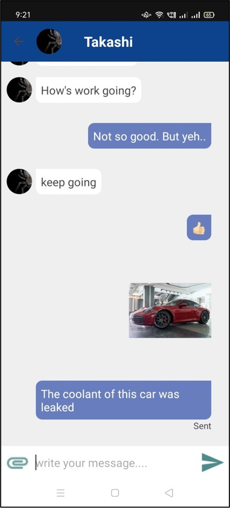
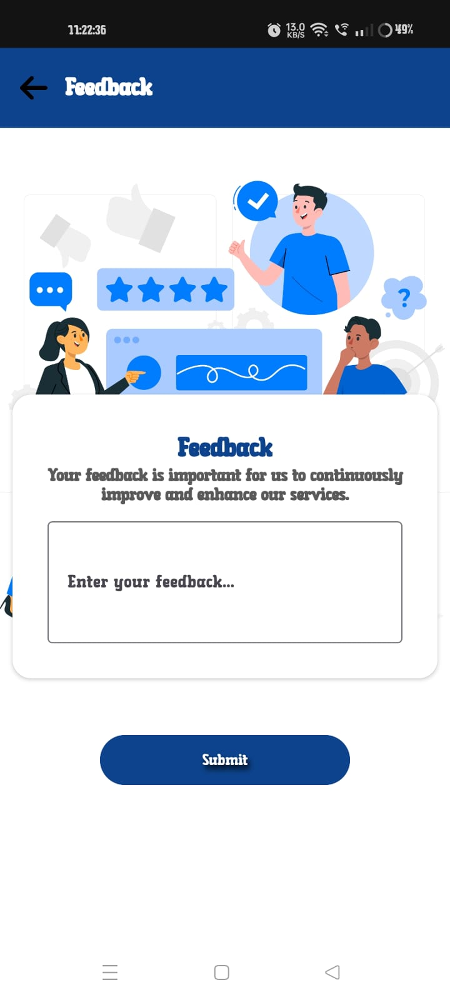

# VisualVerse

VisualVerse is a social media Android application developed in Kotlin. The app offers a dynamic platform for users to connect, share content, and customize their experience. It integrates a Flask server with Python for backend processing and Firebase for database management.

## Features

## Account Creation
Create an account using email or phone number with verification via email or OTP.

### Home Fragment
View posts from accounts you follow, like, comment, and share posts with other VisualVerse users.

### Account Management
Edit your profile, including profile picture, name, bio, and password. You can also delete your account.

 

### Feed Customization
Customize your feed by selecting which topics to prioritize or hide.

### Notifications
Receive customizable notifications for messages, followers, and new posts.

### Usage Tracking
Track app usage time for the past 24 hours. For minor accounts, if usage exceeds 4 hours in a day, the account is temporarily blocked until the next day.

### Chat & Media Sharing
Chat with other users, send images from your gallery, and share posts.

 ### Skilled Account
A special account type with a rating system that is visible to others on the profile.

### Feedback
Provide feedback to help improve the app.

 

### App Sharing
Share VisualVerse via the official website on platforms like WhatsApp, Instagram, and Facebook.
## Technologies Used

- **Android Studio**: Integrated development environment for Android app development.
- **Kotlin**: Programming language used for Android app development.
- **Python & Flask**: Used for backend services and handling notifications.
- **Firebase**: Used for user authentication, real-time database, and notifications.

## Usage

1. Launch the app.
2. Create an account using your email or phone number.
3. Customize your profile and feed.
4. Interact with posts in the Home and Explore sections.
5. Manage notifications and track your app usage.
6. Provide feedback and share the app with others.

## App Download Link - https://visual-verse-app.vercel.app

## Developers

Kalpak Patil 
Email: kalpakpatil131@gmail.com  
GitHub: [Patil-Kalpak](https://github.com/Patil-Kalpak)

Rohan Baria
Email: 4177rb@gmail.com
 
Dhruvesh Bhalekar
Email: bhalekardhruvesh2006@gmail.com  
 

